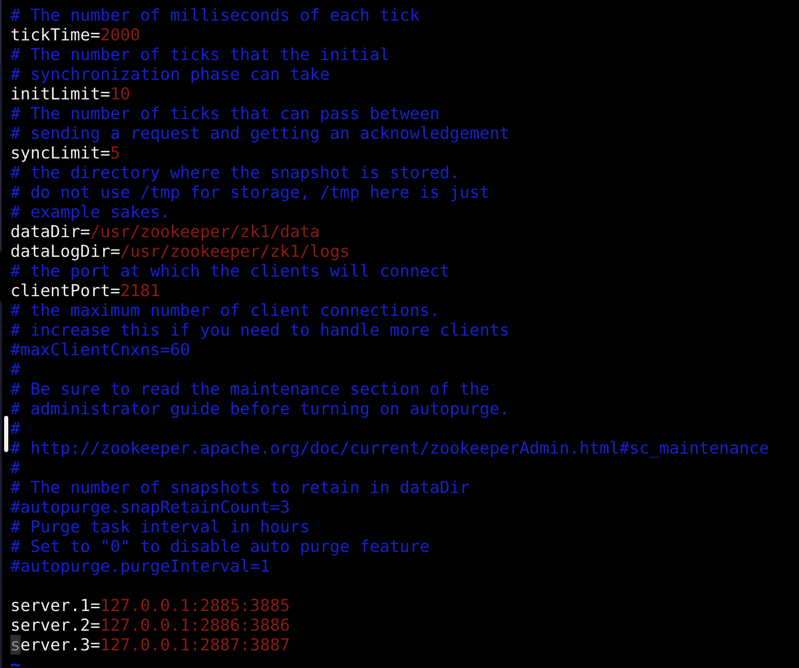
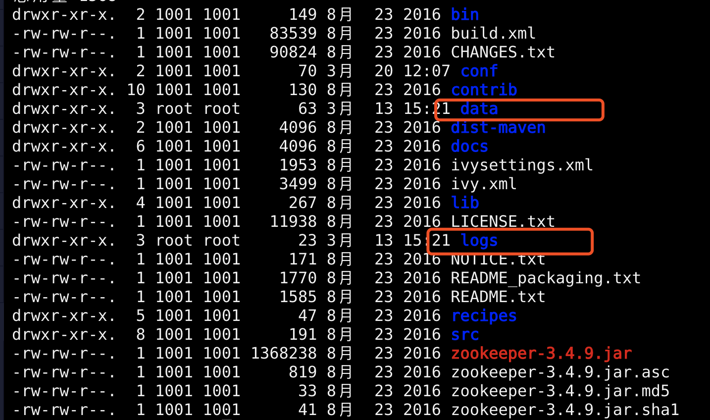
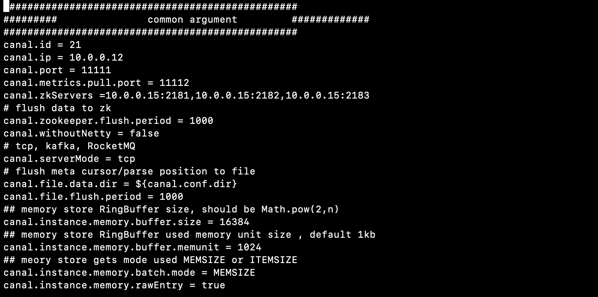
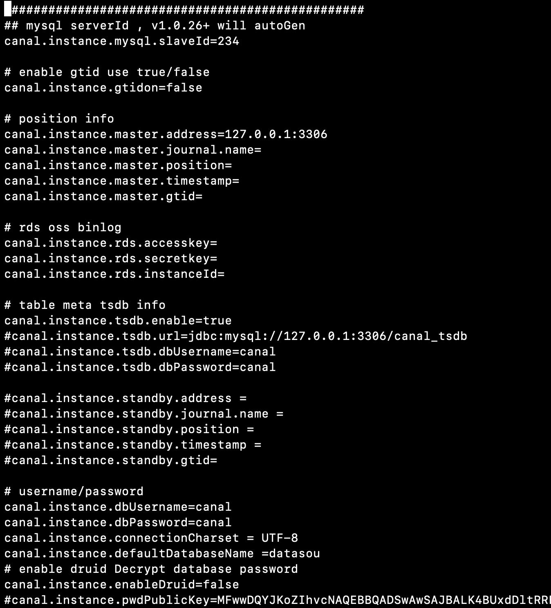
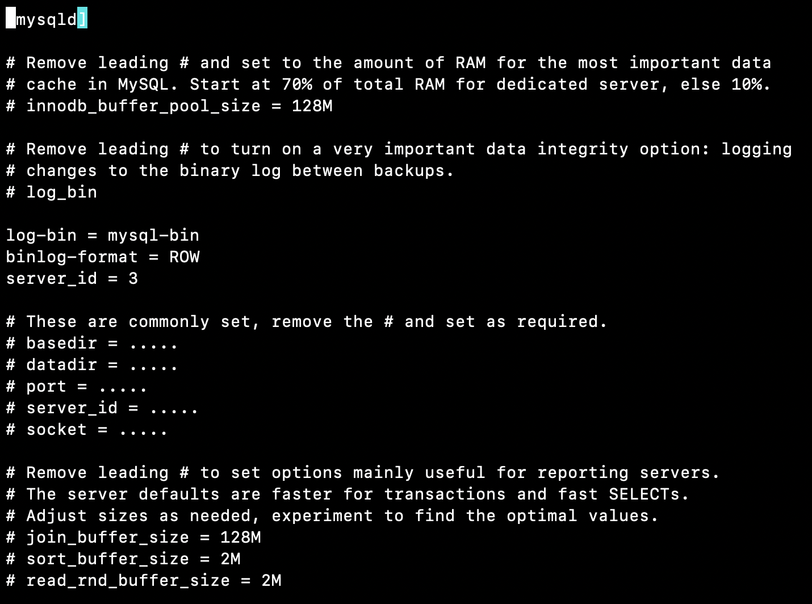

- [Canal](#Canal)
  - [项目介绍](#%E9%A1%B9%E7%9B%AE%E4%BB%8B%E7%BB%8D)
  - [版本依赖](#%E7%89%88%E6%9C%AC%E4%BE%9D%E8%B5%96)
  - [如何部署](#%E5%A6%82%E4%BD%95%E9%83%A8%E7%BD%B2)
  - [安装教程](#%E5%AE%89%E8%A3%85%E6%95%99%E7%A8%8B)
    - [1. 先搭个zk环境；](#1-%E5%85%88%E6%90%AD%E4%B8%AAzk%E7%8E%AF%E5%A2%83)

    - [2. 搭建canal集群；](#2-%E6%90%AD%E5%BB%BAcanal%E9%9B%86%E7%BE%A4)

  - [调用说明](#%E8%B0%83%E7%94%A8%E8%AF%B4%E6%98%8E)
    - [1. Canal-Client；](#1-Canal-Client)
       
# Canal

## 项目介绍

canal阿里巴巴提供的开源的数据抽取项目，能够做到实时抽取，原理就是伪装成mysql从节点，读取mysql的binlog，基于数据库的日志解析，获取增量变更进行同步, 提供增量数据订阅&消费, 生成消息，客户端订阅这些数据变更消息，处理并存储。

## 版本依赖

1. spring cloud Finchley ;
2. spring boot 2.0.5 ;
3. zookeeper 3.4.9 ;
4. canal 1.1.2 ;
5. JDK 1.8
6. Mysql 5.6

## 如何部署

配置：

集群最低配置zookeeper X3 + canal X2，

增加机器数量可以提高稳定性，但是对消费速度不影响；

## 安装教程

### 1. 先搭个zk环境；

- #### 1  zookeeper下载

##### 1.1 下载地址:http://zookeeper.apache.org/

##### 1.2 zookeeper(正常的zookeeper服务要求安装是奇数个，因为zookeper的leader选举，要求可用节点数量 > 总节点数量/2 )

##### 1.3 zk3.4.6或3.4.9是稳定版本;

- #### 2 安装

##### 2.1 三台机器解压安装包: tar -zxvf zookeeper-3.4.9.tar.gz

##### 2.2 进入conf修改cfg文件名 : mv zoo_sample.cfg zoo.cfg

- #### 3 Zookeeper集群配置

##### 3.1 配置zoo.cfg

    tickTime：leader-follower通信心跳时间，也就是每个 tickTime 时间就会发送一个心跳，单位ms；
    initLimit：Leader-Follower初始通信时限，初始连接时能容忍的最多心跳数（tickTime的数量），比如这里 initLimit=10就是10次心跳（2000ms X 10）无应答，则认为连接失败；
    syncLimit：Leader-Follower同步通信时限，请求和应答之间能容忍的最多心跳数，比如这里syncLimit=5 就是5次心跳（2000ms X 10）无应答，则认为同步失败；
    dataDir：数据文件目录，默认情况下保存数据和日志；可以把myid也放这个目录下；
    dataLogDir=/usr/zookeeper/zk1/logs: 日志文件目录, 用来保存日志目录信息
    clientPort：zookeeper客户端的连接端口；
    server.1,server.2,server.3：这里的编号1，2，3对应集群中机器的myid设的数值，必须一一对应；
    2885端口号是zookeeper服务之间通信的端口。
    3885端口是zookeeper与其他应用程序通信的端口。

##### 3.2 创建myid文件，配置serverID

进入canal目录, 创建data 和 logs 文件夹 : mkdir data , mkdir logs

进入data目录: cd data ,创建myid文件 : vim myid ,里面配置server对应的数字编号(如:1)

- #### 4 启动集群

三台机器都配置好后，进入bin目录

启动./zkServer.sh start

附常用命令：

停机：./zkServer.sh stop，

查看状态：./zkServer.sh status，

进入zk客户端：./zkCli.sh -server 127.0.0.1:2181(如果默认端口可直接进入./bin/zkCli.sh)

### 2. 搭建canal集群；

- #### 1  canal下载

 下载地址:https://github.com/alibaba/canal/releases

- #### 2  安装

##### 2.1 上传到指定目录解压 : tar -zxvf canal.deployer-1.1.2.tar.gz

##### 2.2 解压后进入conf目录：cd canal/conf

##### 2.3 修改canal.properties配置文件(系统配置文件) : vim canal.properties

    canal.id= 21 #每个canal server实例的唯一标识，保证每台canal机器id不同；
    canal.ip= #canal server绑定的本地IP信息，如果不配置，默认选择一个本机IP进行启动服务，默认:无
    canal.port= 11111 #canal server提供socket服务的端口，默认:11111
    canal.zkServers= X.X.X.X:2181,X.X.X.X:2181 #canal server链接zookeeper集群的链接信息
    canal.zookeeper.flush.period = 1000 #canal持久化数据到zookeeper上的更新频率，单位毫秒
    canal.withoutNetty = false
    canal.serverMode = tcp    #canal server端的模式，可选
    canal.file.data.dir = ${canal.conf.dir}
    canal.instance.filter.druid.ddl = true 
    canal.instance.filter.query.dcl = true #是否忽略DCL的query语句，比如grant/create user等，默认false
    canal.instance.filter.query.dml = true #是否忽略DML的query语句，比如insert/update/delete table.(mysql5.6的ROW模式可以包含statement模式的query记录),默认false
    canal.instance.filter.query.ddl = true #是否忽略DDL的query语句，比如create table/alater table/drop table/rename table/create index/drop index. (目前支持的ddl类型主要为table级别的操作，create databases/trigger/procedure暂时划分为dcl类型),默认false

##### 2.4. 修改instance.properties配置文件(instance级别的配置文件): vim example/instance.properties 

    canal.instance.mysql.slaveId=234 #mysql集群配置中的serverId概念，需要保证和当前mysql集群中id唯一,默认:1234
    canal.instance.master.address=X.X.X.X:3306 #mysql主库链接地址,默认:127.0.0.1:3306
    canal.instance.master.journal.name= #mysql主库链接时起始的binlog文件,默认:无
    canal.instance.master.position= #mysql主库链接时起始的binlog偏移量,默认:无	
    canal.instance.master.timestamp= #mysql主库链接时起始的binlog的时间戳,默认:无
    canal.instance.dbUsername=canal #mysql数据库帐号	
    canal.instance.dbPassword=canal #mysql数据库密码	
    canal.instance.connectionCharset = UTF-8 #数据解析编码
    canal.instance.defaultDatabaseName =kuaiche #mysql链接时默认schema	
    canal.instance.filter.regex=kuaiche.bill_transport
    canal.instance.filter.black.regex= # 过滤黑名单：

- #### 3  安装创建mysql的canal用户

##### 3.1. 登录mysql : mysql -u root -p

    mysql> CREATE USER 'canal'@'localhost' IDENTIFIED BY 'canal';
    Query OK, 0 rows affected (0.00 sec)
    mysql> GRANT ALL PRIVILEGES ON *.* TO 'canal'@'localhost' WITH GRANT OPTION;
    Query OK, 0 rows affected (0.01 sec)
    mysql> CREATE USER 'canal'@'%' IDENTIFIED BY 'canal';
    Query OK, 0 rows affected (0.00 sec)
    mysql> GRANT ALL PRIVILEGES ON *.* TO 'canal'@'%' WITH GRANT OPTION;
    Query OK, 0 rows affected (0.00 sec)
    mysql> flush privileges;
    Query OK, 0 rows affected (0.00 sec)

##### 3.2. 开启mysql binlog 日志 (以下示例是mac版)

进入etc目录下 , 找到my.cnf文件

编辑my.cnf, 添加以下内容 : vim my.cnf 

    log-bin = mysql-bin #开启binlog
    binlog-format = ROW #选择row模式
    server_id = 1 #配置mysql replication需要定义，不能喝canal的slaveId重复

##### 3.3. 重启mysql, 查看是否支持binlog

登录:mysql -u root -p

    mysql> show variables like 'log_bin';
    +---------------+-------+
    | Variable_name | Value |
    +---------------+-------+
    | log_bin       | ON   |
    +---------------+-------+
    1 row in set (0.00 sec)

- #### 4  启动canal集群

##### 4.1 进入bin目录启动canal: ./startup.sh

附常用命令：

停机：./stop.sh，

查看启动日志 cat logs/canal/canal.log

## 调用说明

### 1. Canal-Client；

- #### 1  新建spring boot项目

##### 1.1 boot 版本 2.0.5 服务治理为cloud Finchley版本

##### 1.2 添加canal client依赖jar包 
 
		<dependency>
			<groupId>com.alibaba.otter</groupId>
			<artifactId>canal.client</artifactId>
			<version>1.1.2</version>
		</dependency>

- #### 2  canal数据结构

##### 2.1 Entry数据结构

    Entry
        Header
            version         [协议的版本号,default = 1]
            logfileName     [binlog文件名]
            logfileOffset   [binlog position]
            serverId        [服务端serverId]
            serverenCode    [变更数据的编码]
            executeTime     [变更数据的执行时间]
            sourceType      [变更数据的来源,default = MYSQL]
            schemaName      [变更数据的schemaname]
            tableName       [变更数据的tablename]
            eventLength     [每个event的长度]
            eventType       [insert/update/delete类型,default = UPDATE]
            props           [预留扩展]
            gtid            [当前事务的gitd]
        entryType           [事务头BEGIN/事务尾END/数据ROWDATA/HEARTBEAT/GTIDLOG]
        storeValue          [byte数据,可展开，对应的类型为RowChange]    
    RowChange
        tableId             [tableId,由数据库产生]
        eventType           [数据变更类型,default = UPDATE]
        isDdl               [标识是否是ddl语句，比如create table/drop table]
        sql                 [ddl/query的sql语句]
        rowDatas            [具体insert/update/delete的变更数据，可为多条，1个binlog event事件可对应多条变更，比如批处理]
            beforeColumns   [字段信息，增量数据(修改前,删除前),Column类型的数组]
            afterColumns    [字段信息，增量数据(修改后,新增后),Column类型的数组] 
            props           [预留扩展]
        props               [预留扩展]
        ddlSchemaName       [ddl/query的schemaName，会存在跨库ddl，需要保留执行ddl的当前schemaName]
    Column 
        index               [字段下标]      
        sqlType             [jdbc type]
        name                [字段名称(忽略大小写)，在mysql中是没有的]
        isKey               [是否为主键]
        updated             [是否发生过变更]
        isNull              [值是否为null]
        props               [预留扩展]
        value               [字段值,timestamp,Datetime是一个时间格式的文本]
        length              [对应数据对象原始长度]
        mysqlType           [字段mysql类型]
    
##### 2.2 canal功能含义   
    
- 连接，connector.connect() 
- 订阅，connector.subscribe 
- 获取数据，connector.getWithoutAck() 
- 业务处理 
- 提交确认,connector.ack() 
- 回滚，connector.rollback() 
- 断开连接，connector.disconnect()

    
- #### 3  配置信息 
    
##### 3.1 application.yml配置文件

    canal:
      server:
        url:   #单机配置,local/dev/test环境使用
        port:   #单机配置,local/dev/test环境使用
        destination: example #环境共用参数
        username:
        password:
        subscribe: #需要监控库的mysql表
          t_user
        refreshSeconds: 10 #单位：秒
        zkServers: 10.0.0.15:2181,10.0.0.15:2182,10.0.0.15:2183   # zookeeper HA高可用配置,forecast/prod环境使用
        dbname: datasou #数据库名称
    
- #### 4  连接实例订阅binlog

##### 4.1 加载配置信息
    
    @Value("${canal.server.zkServers}")
    private String zkServers;

    @Value("${canal.server.subscribe}")
    private String subscribe;

    @Value("${canal.server.destination}")
    private String destination;

    @Value("${canal.server.refreshSeconds}")
    private long refreshSeconds;

    @Value("${canal.server.dbname}")
    private String dbname;

    @Value("${canal.server.username}")
    private String username;

    @Value("${canal.server.password}")
    private String password;

    private CanalConnector connector;

    private long batchId = 0;    
    
##### 4.2 初始化连接
    
    if(null==connector || !connector.checkValid()){
        try {
            connector = CanalConnectors.newClusterConnector(zkServers, destination, username, password);
            connector.connect();
            connector.subscribe(".*\\..*");  // 监控所有表所有库
            log.debug(">>>> Connection canal server successful,zkServers：【{}】,subscribe：【{}】 <<<<<",zkServers,subscribe);
        } catch (Exception e) {
            log.debug(">>>> Connection canal server failed,zkServers：【{}】,subscribe：【{}】, exception：【{}】...try again after 10s <<<<<",zkServers,subscribe,e.getMessage());
            Thread.sleep(Concom.EXCEPTION_SECONDS);
        }
    }                 
 
##### 4.3 拉取日志信息

    try {
        // 获取指定数量的数据
        Message messages = connector.getWithoutAck(Concom.CANAL_BATCH_SIZE);
        if(null == messages){
            log.debug(">>>> Canal client connect zookeeper server is running, get Message is null!");
            Thread.sleep(Concom.EXCEPTION_SECONDS);
            continue;
        }

        //获取同步id
        batchId = messages.getId();
        int size = messages.getEntries().size();
        if (batchId == -1 || size == 0) {
            try {
                Thread.sleep(Concom.MAX_SLEEP_SECONDS);
                connector.ack(batchId);
            } catch (InterruptedException e) {
                e.printStackTrace();
            }
            log.info(">>>> Canal client No DATA change ! batchId={}  <<<<<", batchId);
        } else {
            //处理信息
            controller.publishCanalListEvent(messages.getEntries());
            connector.ack(batchId);
            log.info(">>>> Canal client consume canal  {}   is  success!!!  <<<<<", batchId);
        }
    }catch (Exception e){
        log.error("read canal message error , exception : ", e);
        // 处理失败, 按偏移量回滚数据
        connector.rollback(batchId);
    }   

##### 4.4 日志信息处理

    public void publishCanalListEvent(List<Entry> entries) {
        for (Entry entry : entries) {

            //事物过滤
            if (entry.getEntryType().equals(EntryType.TRANSACTIONBEGIN)
                    || entry.getEntryType().equals(EntryType.TRANSACTIONEND)
                    || EventType.QUERY.equals(entry.getHeader().getEventType())) {
                continue;
            }

            //解析日志信息
            RowChange rowChage = null;
            try {
                rowChage = RowChange.parseFrom(entry.getStoreValue());
            } catch (Exception e) {
                throw new RuntimeException("ERROR ## parser of eromanga-event has an error , data:" + entry.toString(),
                        e);
            }

            //打印BINLOG日志信息
            System.err.println(String.format("================> binlog[%s:%s] , name[%s,%s] , eventType : %s",
                    entry.getHeader().getLogfileName(), entry.getHeader().getLogfileOffset(),
                    entry.getHeader().getSchemaName(), entry.getHeader().getTableName(), rowChage.getEventType()));

            //封装LOG实体
            LogEntity logEntity = new LogEntity()
                    .index(entry.getHeader().getSchemaName())
                    .eventType(rowChage.getEventType().toString())
                    .docType(entry.getHeader().getTableName());

            //操作日志
            publishCanalEvent(rowChage,logEntity);
        }
    }